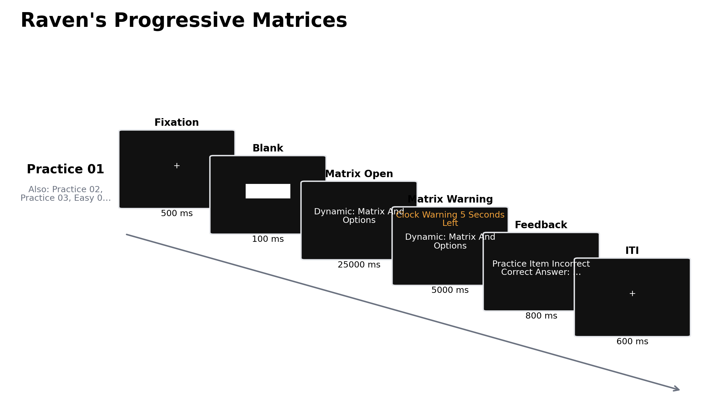

# Raven 渐进矩阵的关系推理测量逻辑、神经基础与方法学边界

流体推理研究需要在尽量减少既有知识和语言表达要求的条件下，测量个体从新异材料中抽取关系、形成规则并据此作出推断的能力。Raven 渐进矩阵（Raven’s Progressive Matrices, RPM）以缺失图形补全为基本操作：作答者须比较矩阵单元的属性变化，归纳横向或纵向关系，并从候选项中选出满足这些关系的图形。该范式因反应规则简洁、可使用抽象图形且容易参数化，长期用于一般能力与流体智力研究。然而，“非言语”只描述刺激与作答形式，不能推出测量不受教育经验、视觉加工、策略、工作记忆或时间限制影响。RPM 的科学价值主要来自其可分解的关系规则与难度操作；相应地，任何短版、限时版或程序生成版都需要重新说明其构念范围，而不能仅凭外观相似继承标准测验的常模与效度。

## 1. 范式起源与理论问题

Raven 于 1938 年形成渐进矩阵测验，并在随后发表的标准化研究中报告其施测与常模基础（Raven, 1941）。经典题目由一个缺失单元的图形矩阵和若干候选答案组成，项目按难度递增排列。测验把关系抽取置于作答中心：局部形状本身通常不决定答案，作答者必须识别属性在行、列或二者之间如何保持、递进、分布、叠加或相消。标准渐进矩阵、彩色渐进矩阵和高级渐进矩阵服务于不同年龄和能力范围，但均保留这一归纳—检验—选择结构。

Carpenter 等（1990）依据口语报告、眼动和错误模式，将高级渐进矩阵的主要关系概括为行内恒定、成对数量递进、图形加减、三值分布与二值分布等规则。他们的计算模型指出，项目难度随必须同时维持的规则数、规则实例数以及目标—子目标管理负荷而增加。这一解释把总分所代表的“流体推理”落实为若干可检验过程：编码图形属性、发现对应关系、在工作记忆中维持候选规则、整合多重关系、排除不一致候选项。近期双任务实验进一步表明，对中央执行成分施加负荷会降低高级渐进矩阵成绩，但该操控仅解释部分成绩变异；工作记忆是任务表现的必要贡献因素之一，不能穷尽流体智力构念（Hagemann et al., 2023）。

## 2. 任务逻辑、测量指标与条件控制

典型试次先呈现二维矩阵，其中右下或其他位置留空；候选项同时或随后出现，作答者选择唯一最符合整体关系的答案。正式版本常以正确数为主要指标，实验改编还记录项目级反应时、超时、候选查看顺序和眼动转换。正确率反映规则发现、关系整合、知觉辨别与决策的共同结果；反应时还受速度—准确权衡和时间压力影响。单纯把较长反应时解释为更深推理，或把错误直接归因于关系整合不足，均缺少过程识别依据。

经典施测通常采用固定题序，正式题不提供逐题正确性反馈，也不依据当前表现实时改变下一题难度；由易至难的编排兼有熟悉任务要求与扩展能力区分范围的作用。计算机实验可改为逐题限时、随机顺序或基于题库的自适应选题，但这些改动分别改变速度负荷、序列效应与受试者实际接触的项目集合。总限时与逐题限时也不等价：前者允许作答者在项目间自行分配时间，后者限制单题搜索与规则检验。因而，研究报告应同时说明题数、顺序、候选出现方式、计时起点、超时处理和反馈规则；若采用自适应程序，还需报告项目标定模型、起始难度、选题准则与停止规则（Poulton et al., 2022; Tatel et al., 2022）。

规则复杂度是最有理论针对性的条件操作。零关系项目可通过知觉匹配完成；一关系项目要求沿一个维度发现变化；二关系项目要求联合考虑两个维度。二关系减一关系对比由此较接近“关系整合”，但仍可能伴随更多视觉搜索、更长保持时间和更高总体难度。Kroger 等（2002）通过分别增加关系复杂度和无关干扰图形，发现二者都会增强额顶活动，而较高关系复杂度对左前部前额叶的招募更具选择性。这种设计说明，只有将关系数与一般难度、干扰量分开操控，神经或行为差异才具有较明确的构念含义。

候选项构造同样影响测量。若干扰项只改变一个显著属性，作答者可能通过局部匹配或逐项排除获得正确答案；若干扰项对应常见错误规则，则错误分布可用于检验规则表征。眼动研究区分了先在矩阵中构造理想答案再比对候选项的“建构匹配”策略，以及在矩阵与候选项之间反复转换的“反应排除”策略。两类策略的使用随能力与项目难度变化，眼动转换次数、首次查看候选项的潜伏期及矩阵区域停留比例均能预测表现（Vigneau et al., 2006）。因此，相同总分可能由不同解题过程产生。

## 3. 行为与神经科学证据

### 3.1 规则归纳、策略与发展变化

RPM 成绩通常与多种推理和一般能力指标相关，但矩阵表现具有明确的任务成分。规则数量、规则抽象程度、知觉显著性、候选结构和作答策略共同决定项目难度（Carpenter et al., 1990; Matzen et al., 2010）。重复施测也并非过程不变。Bors 与 Vigneau（2003）在三次施测中观察到平均总分持续提高，同时多数单题的跨次稳定性很低；成绩增益更符合对这类项目的一般学习，而非简单记住具体答案。研究设计若把前测—后测增益直接解释为一般流体能力提高，需要排除规则熟悉、策略改变与测验暴露效应。

发展研究把关系数作为可控负荷，发现 8—12 岁儿童与成人均招募外侧前额叶和顶叶区域，但在一关系与二关系条件中的激活时间进程和分化程度不同。成人的吻侧外侧前额叶对二关系整合表现出更明确的选择性，儿童在一关系条件中也持续招募该区域，提示关系整合的功能专门化在儿童期仍处于发展过程（Crone et al., 2009）。开放矩阵题库 MaRs-IB 在 11—33 岁样本中同样观察到正确率在青春期上升并于成年早期趋稳，而速度—准确综合效率在青春期后期达到较高水平（Chierchia et al., 2019）。年龄差异因而不宜只用速度或正确率单独概括。

### 3.2 fMRI 与 EEG 所揭示的过程

任务态功能磁共振成像（functional magnetic resonance imaging, fMRI）研究支持额顶网络参与矩阵推理，但不同区域的活动依赖具体操作。Prabhakaran 等（1997）将分析推理、图形/视空间推理与知觉—运动匹配分开：图形推理相对匹配更多涉及右额叶和双侧顶叶，分析推理相对图形推理还增加双侧额叶及左侧顶、枕、颞区活动。该结果支持矩阵解题调用多个工作记忆与执行过程，而非单一“推理中枢”。Christoff 等（2001）进一步发现，需要整合两个变化维度的项目相对零或一关系项目更强地招募吻侧外侧前额叶；Kroger 等（2002）的参数化结果则将关系整合需求与一般干扰难度部分分离。上述 BOLD 差异说明相关网络随任务要求变化，不能单独证明某一区域对一般智力具有因果作用。

脑电（electroencephalography, EEG）提供了矩阵求解期间的时间进程信息。Ociepka 等（2023）让 160 名成人在候选项出现前观察每道高级渐进矩阵 30 秒，并随机化项目顺序以控制难度与序列混淆。流体智力与任务期 δ 功率呈正相关，与去除空闲等待活动后的 α 和低 β 活动呈负相关；不同频带合计解释了部分个体差异。慢节律频率与能力的关系还表现出性别条件性。该研究说明“神经效率”不能简化为全频段活动越低越好，且结果依赖难度控制、时间窗划分与样本特征。头皮信号也不支持对深部或局部脑源作确定定位。

## 4. 范式发展与应用

标准题目的版权与有限数量限制了重复测量、神经成像和大规模在线研究。Matzen 等（2010）把原题中的关系类型参数化，生成大量 Raven 风格项目，并通过常模研究显示生成题可覆盖并扩展标准题的难度范围。MaRs-IB 随后提供 80 道开放项目、在线实现和项目级数据，使年龄比较与开放复现更可行（Chierchia et al., 2019）。这些工作改变了范式的研究用途：实验者可以独立操控关系数、视觉属性和候选项，而不必把受版权保护的临床测验直接搬入实验程序。生成题仍须进行项目分析、难度标定和外部效度检验；“Raven 风格”描述的是任务家族，不构成与正式 RPM 的测量等价声明。

临床与教育应用还揭示了单一测验解释的边界。Dawson 等（2007）报告，自闭症儿童的 RPM 百分位显著高于其 Wechsler 量表成绩，提示依赖语言和多子测验汇总的智力估计可能低估部分个体的非言语关系推理。后续研究仅在部分低 Wechsler 成绩的自闭症个体中复现较小差异，并主张采用多维度评估（Bölte et al., 2009）。RPM 可作为能力剖面的补充指标，不能凭单项成绩完成临床诊断或推断全面智力水平。

## 5. 信度、效度与解释边界

完整测验的总分稳定性不自动转移到短版和单题。九题 RSPM 预测短版在开发与验证样本中能够较好预测长版总分，但这种嵌入式预测效度不等于独立施测时的重测信度（Bilker et al., 2012）。在两个大样本中，12 题在线 APM 的计时版和非计时版均表现为单维结构，并与 Wechsler 知觉推理及全量表智商呈中等相关；其重测信度仅为 .65—.69，非计时版的项目与效度表现总体更优（Poulton et al., 2022）。短测验适合群体研究或电池中的快速指标时，仍需报告测量误差，避免对个体作精细排序。

施测参数本身会改变构念组成。汇集 142 项研究、26,848 名参与者的元分析显示，缩短题数或增强速度要求会改变 APM 与空间可视化、记忆及知觉速度的相关模式，提示不同版本可能调用不同能力组合（Tatel et al., 2022）。固定递增顺序还会把项目难度与疲劳、练习和剩余时间混合；随机顺序虽能削弱序列混淆，却会偏离标准施测。跨文化使用也不能从低语言负荷推导文化公平，因为图形材料熟悉度、受教育质量、考试经验与常模年代仍可能影响成绩。矩阵正确率宜表述为特定版本、样本与施测条件下的非言语关系推理表现；只有经过规范化、信效度验证并使用相应常模的正式测验，才适合进行标准分解释。

## 6. TaskBeacon 中的任务实现

### 6.1 任务资源与访问入口

| 资源 | ID | 用途 | 地址 |
|---|---|---|---|
| 完整任务源码 | T000048 | PsychoPy/PsyFlow 行为实验实现 | [GitHub](https://github.com/TaskBeacon/T000048-ravens-progressive-matrices) |
| 浏览器伴随源码 | H000048 | `psyflow-web` 行为型浏览器预览 | [GitHub](https://github.com/TaskBeacon/H000048-ravens-progressive-matrices) |
| 在线体验 | H000048 | 在共享运行器中体验任务流程 | [运行页面](https://taskbeacon.github.io/psyflow-web/?task=H000048-ravens-progressive-matrices) |

TaskBeacon 当前版本是英文、键盘作答的行为实现。T000048 使用程序生成的几何图形，不包含标准 RPM 的受版权保护题目；H000048 保留相同的 15 项题库、阶段和反应语义，用于浏览器预览。两者均处于 draft 阶段，浏览器版不应被视为已建立常模的正式 Raven 测验。

### 6.2 实现流程与关键参数

**图 1. TaskBeacon 当前版本的试次流程。** 单次任务按固定顺序呈现 3 道练习题以及 easy、medium、hard 各 4 道正式题。每题先呈现 500 ms 注视点与 100 ms 白色空屏，随后显示右下单元缺失的 3×3 矩阵和四个候选卡；前 25 s 可按 `1`—`4` 作答，未反应时在同一刺激上增加时钟提示并开放最后 5 s，故总反应窗为 30 s。练习题依据正确、错误或超时呈现 800 ms 反馈，正式题无反馈，末尾为 600 ms 注视点间隔。矩阵规则由形状、数量与旋转沿行列的组合变化生成；easy 主要组合形状与数量，medium 加入旋转，hard 进一步采用三元布局。正确选项与三个分别改变形状、数量或旋转的干扰项经确定性伪随机排序，位置固定映射为左上 `1`、右上 `2`、左下 `3`、右下 `4`。总体种子为 2026，题序固定且不存在基于表现的自适应调整。

主要项目级输出包括条件与模板、正确键及位置、实际选择、反应阶段、反应时、正确性和超时状态。正式题仅 12 道，easy/medium/hard 是生成模板的设计标签，现有证据未提供独立项目标定或与正式 RPM 常模的等值关系。该实现适合演示矩阵推理流程、收集探索性行为数据或作为进一步标定的刺激生成起点；其原始正确数不宜换算为 IQ、百分位或临床分类。

## 参考文献

Bilker, W. B., Hansen, J. A., Brensinger, C. M., Richard, J., Gur, R. E., & Gur, R. C. (2012). Development of abbreviated nine-item forms of the Raven’s Standard Progressive Matrices Test. *Assessment, 19*(3), 354–369. https://doi.org/10.1177/1073191112446655

Bölte, S., Dziobek, I., & Poustka, F. (2009). Brief report: The level and nature of autistic intelligence revisited. *Journal of Autism and Developmental Disorders, 39*(4), 678–682. https://doi.org/10.1007/s10803-008-0667-2

Bors, D. A., & Vigneau, F. (2003). The effect of practice on Raven’s Advanced Progressive Matrices. *Learning and Individual Differences, 13*(4), 291–312. https://doi.org/10.1016/S1041-6080(03)00015-3

Carpenter, P. A., Just, M. A., & Shell, P. (1990). What one intelligence test measures: A theoretical account of the processing in the Raven Progressive Matrices Test. *Psychological Review, 97*(3), 404–431. https://doi.org/10.1037/0033-295X.97.3.404

Chierchia, G., Fuhrmann, D., Knoll, L. J., Pi-Sunyer, B. P., Sakhardande, A. L., & Blakemore, S.-J. (2019). The matrix reasoning item bank (MaRs-IB): Novel, open-access abstract reasoning items for adolescents and adults. *Royal Society Open Science, 6*(10), 190232. https://doi.org/10.1098/rsos.190232

Christoff, K., Prabhakaran, V., Dorfman, J., Zhao, Z., Kroger, J. K., Holyoak, K. J., & Gabrieli, J. D. E. (2001). Rostrolateral prefrontal cortex involvement in relational integration during reasoning. *NeuroImage, 14*(5), 1136–1149. https://doi.org/10.1006/nimg.2001.0922

Crone, E. A., Wendelken, C., Van Leijenhorst, L., Honomichl, R. D., Christoff, K., & Bunge, S. A. (2009). Neurocognitive development of relational reasoning. *Developmental Science, 12*(1), 55–66. https://doi.org/10.1111/j.1467-7687.2008.00743.x

Dawson, M., Soulières, I., Gernsbacher, M. A., & Mottron, L. (2007). The level and nature of autistic intelligence. *Psychological Science, 18*(8), 657–662. https://doi.org/10.1111/j.1467-9280.2007.01954.x

Hagemann, D., Ihmels, M., Bast, N., Neubauer, A. B., Schankin, A., & Schubert, A.-L. (2023). Fluid intelligence is (much) more than working memory capacity: An experimental analysis. *Journal of Intelligence, 11*(4), 70. https://doi.org/10.3390/jintelligence11040070

Kroger, J. K., Sabb, F. W., Fales, C. L., Bookheimer, S. Y., Cohen, M. S., & Holyoak, K. J. (2002). Recruitment of anterior dorsolateral prefrontal cortex in human reasoning: A parametric study of relational complexity. *Cerebral Cortex, 12*(5), 477–485. https://doi.org/10.1093/cercor/12.5.477

Matzen, L. E., Benz, Z. O., Dixon, K. R., Posey, J., Kroger, J. K., & Speed, A. E. (2010). Recreating Raven’s: Software for systematically generating large numbers of Raven-like matrix problems with normed properties. *Behavior Research Methods, 42*(2), 525–541. https://doi.org/10.3758/BRM.42.2.525

Ociepka, M., Kałamała, P., & Chuderski, A. (2023). Take your time: Slow brain rhythms predict fluid intelligence. *Intelligence, 100*, 101780. https://doi.org/10.1016/j.intell.2023.101780

Poulton, A., Rutherford, K., Boothe, S., Brygel, M., Crole, A., Dali, G., Bruns, L. R., Jr., Sinnott, R. O., & Hester, R. (2022). Evaluating untimed and timed abridged versions of Raven’s Advanced Progressive Matrices. *Journal of Clinical and Experimental Neuropsychology, 44*(1), 73–84. https://doi.org/10.1080/13803395.2022.2080185

Prabhakaran, V., Smith, J. A. L., Desmond, J. E., Glover, G. H., & Gabrieli, J. D. E. (1997). Neural substrates of fluid reasoning: An fMRI study of neocortical activation during performance of the Raven’s Progressive Matrices Test. *Cognitive Psychology, 33*(1), 43–63. https://doi.org/10.1006/cogp.1997.0659

Raven, J. C. (1941). Standardization of Progressive Matrices, 1938. *British Journal of Medical Psychology, 19*(1), 137–150. https://doi.org/10.1111/j.2044-8341.1941.tb00316.x

Tatel, C. E., Tidler, Z. R., & Ackerman, P. L. (2022). Process differences as a function of test modifications: Construct validity of Raven’s Advanced Progressive Matrices under standard, abbreviated and/or speeded conditions—A meta-analysis. *Intelligence, 90*, 101604. https://doi.org/10.1016/j.intell.2021.101604

Vigneau, F., Caissie, A. F., & Bors, D. A. (2006). Eye-movement analysis demonstrates strategic influences on intelligence. *Intelligence, 34*(3), 261–272. https://doi.org/10.1016/j.intell.2005.11.003
